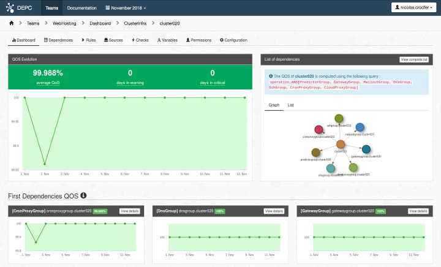

DepC
====

DepC (Dependency Checker) is a **Qos Measurement & Dependency Graph Platform**
created by OVH. We use it to store and request our CMDB and to compute the QoS
of our infrastructure, including our customers.

Overview
--------

DepC provides a CMDB component to store and request related nodes into a graph
structure. These nodes can be anything : servers, products, customers or even
web services. A typical use case would be to create some ``customers`` nodes,
related to their ``products``. We can also link these ``products`` to
``servers``, that way it would be very easy to display the impacted customers
when a problem occurs on a server.

Once DepC knows your dependency graph, it then becomes possible to compute a
QoS for every nodes. By taking up our previous example, Depc can compute the
QoS of our ``customers``, following the QoS of their ``servers``.

Principles
----------

- **Graph Dependency** : We use the *Neo4j* database to manage the nodes and
  their relationships (we already handle several million of nodes in our OVH
  internal instance). DepC provides some API calls and WebUI to easily request
  a node and its relationships.
- **QoS Computation** : DepC can compute a QoS for all nodes in the Graph, but
  of course we have to explain how we do it. We created `different methods
  <https://ovh.github.io/depc/guides/queries.html/>`_ for that : some nodes
  will use the raw data stored in TimeSeries databases (for example a
  ``server`` node having a probe), other nodes will use their parents QoS to
  compute their own one. Finally the QoS can be displayed in Grafana or in the
  DepC WebUI (this last one allows some cool features, like display the worst
  nodes or even the root cause of a bad QoS).
- **Scalability** : *Apache Kafka* is used to receive `payloads
  <https://ovh.github.io/depc/guides/kafka.html/>`_ and forward them to Neo4j,
  adding the wanted scalabily and high-availability management. Then *Apache
  Airflow* is responsible to automate the QoS computation, so DepC can benefit
  from its executors feature (Celery, Kubernetes..) to scale horizontally.

Installation
------------

See https://ovh.github.io/depc/installation.html

Links
-----

* Contribute: https://github.com/ovh/depc/blob/master/CONTRIBUTING.rst
* Report bugs: https://github.com/ovh/depc/issues

License
-------

See https://github.com/ovh/depc/blob/master/LICENSE
