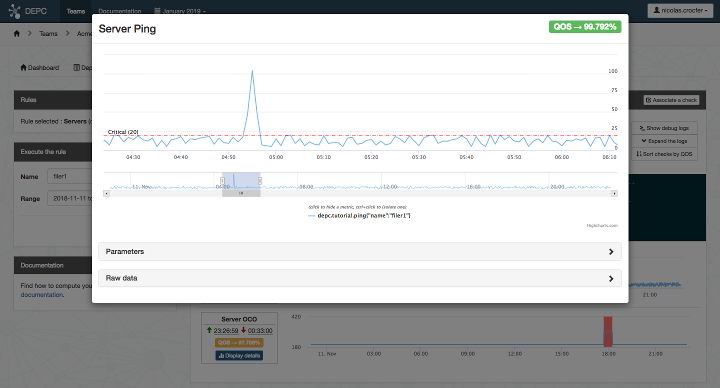

DepC
====

DepC (Dependency Checker) is a tool used to compute the QoS of your
infrastructure based on TimeSeries and Graph databases.

Dependencies
------------

.. image:: depc_dependencies.png
   :alt: DepC QOS
   :align: center

QoS
---

Installation
------------

See https://github.com/ovh/depc/blob/master/docs/installation.rst

Links
-----

* Contribute: https://github.com/ovh/depc/blob/master/CONTRIBUTING.rst
* Report bugs: https://github.com/ovh/depc/issues

License
-------

See https://github.com/ovh/depc/blob/master/LICENSE