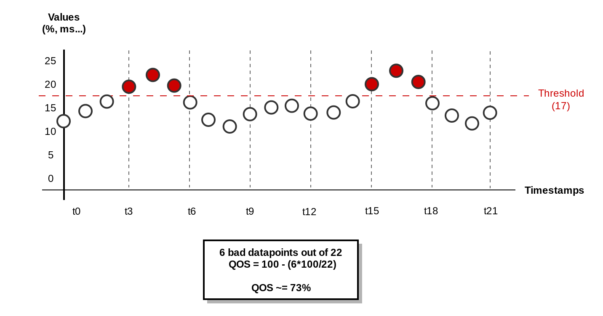
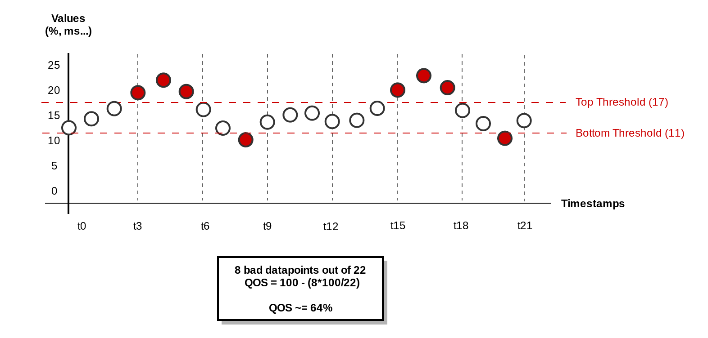

.. _checks:

Check Types
===========

Overview
--------

A check is a Python function that queries a source, retrieves the data
and uses it to compute a QoS percentage. A check is included in a rule :
when we execute a rule, we execute its check(s).

Concretely a check converts some datapoints into a percentage :

.. code:: json

   {
       "1513855920": 109,
       "1513856040": 113,
       "1513856160": 125,
       [...]
       "1513890000": 114
   }

After having been processed by the check, these datapoints will be
converted into a QOS (e.g. **99.456%**).

.. note::
   For now DepC only provides 2 kinds of checks to compute your QOS :
   **Threshold** and **Interval**, but our goal is to add another types
   in the next releases.

Threshold
---------

Every datapoints which is above a given threshold will lower the QOS :

Interval
--------

Same as the threshold check, but datapoints which are not into a given
interval lower the QOS percentage :

.. note::
   Note these examples just use a few datapoints, but
   of course it can be much more in reality (like dozens of thousands).
   This will improve the accuracy of your QOS.
