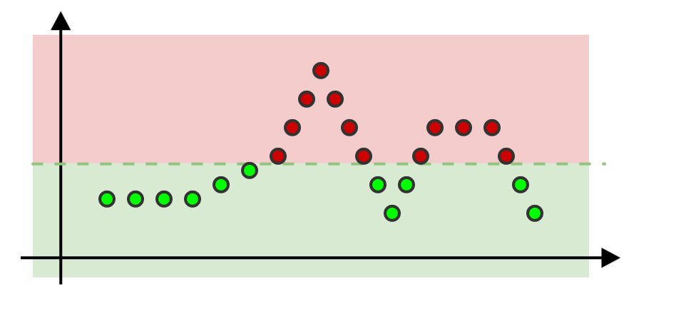
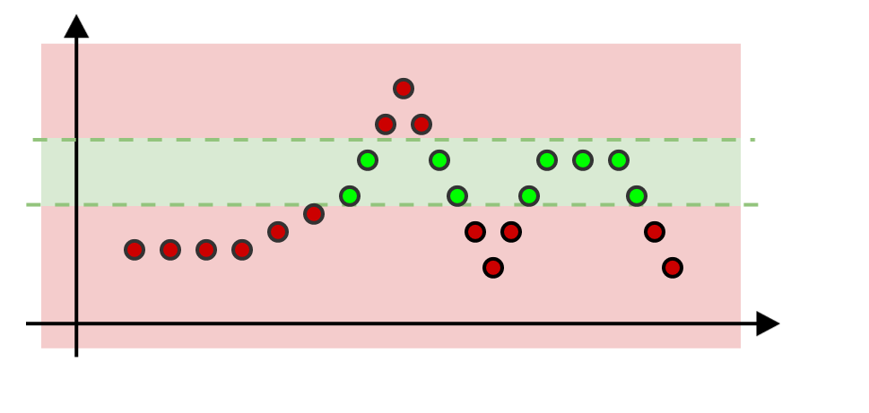

.. _indicators:

Indicators
==========

Overview
--------

.. warning::

   Checks are renamed **Indicators**.

An indicator is a Python function that queries a source, retrieves the data
and uses it to compute a QOS percentage. An indicator is included in a rule :
when we execute a rule, we execute its indicator(s).

Concretely an indicator converts some datapoints into a percentage :

.. code:: json

   {
       "1513855920": 109,
       "1513856040": 113,
       "1513856160": 125,
       [...]
       "1513890000": 114
   }

After having been processed by the indicator, these datapoints will be
converted into a QOS (e.g. **99.456%**).

Simple Threshold
----------------

This indicator defines a threshold when the datapoints will be considered as valid.
Every datapoints which are above a given threshold will lower the QOS.

Threshold examples : ``200``, ``200.1``, ``-200``, ``-200.1``, ...

In this example, the threshold is defined to ``200`` and the effect is illustrated below :

Interval
--------

Likewise the threshold indicator, but datapoints which are not into a given
interval lower the QOS.

Interval examples : ``200:300``, ``-200:200``, ``-300:-200``, ``200.1:300``, ...

In this example, the threshold is defined to ``200:300`` and the effect is illustrated below :

.. note::
   Note these examples just use a few datapoints, but
   of course it can be much more in reality (like dozens of thousands).
   This will improve the accuracy of your QOS.
