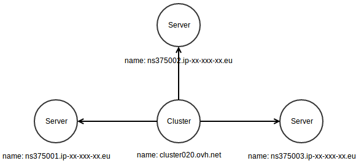

.. _kafka:

Kafka
=====

DepC uses Kafka to manage the graph in Neo4j. Each team has its own
topic and can push messages in it using its own credentials.

Nested message
--------------

You can create new nodes and relationships using the following format :

.. code:: json

   {
     "source": {
       "label": "A",
       "name": "foo",
       "props": {
         "from": 1515241242,
         "to": 1515244850
       }
     },
     "target": {
       "label": "B",
       "name": "bar",
       "props": {
         "from": 1533636245,
         "to": 1533643445
       }
     },
     "rel": {
       "from": 1527847440,
       "to": 1527854640
     }
   }

This message will create 2 linked nodes :

.. figure:: ../_static/images/quickstart/kafka1.png
   :alt: DepC Kafka 1
   :align: center

Only the **source** key is mandatory, it means the **target**, **rel**
and **props** keys are optionals. So the smallest message can be the
following one :

.. code:: json

   {
    "source": {
       "label": "A",
       "name": "foo"
     }
   }

.. figure:: ../_static/images/quickstart/kafka2.png
   :alt: DepC Kafka 2
   :align: center

Flat message
------------

If you Kafka client does not support the nested structure for your
message, or if your prefer this form, you can also send us a flat
message :

.. code:: json

   {
     "source_label": "A",
     "source_name": "foo",
     "source_from": 1515241242,
     "source_to": 1515244850,
     "target_label": "B",
     "target_name": "bar",
     "target_from": 1533636245,
     "target_to": 1533643445,
     "rel_from": 1527847440,
     "rel_to": 1527854640
   }

The only mandatory keys are **source_label** and **source_name**.

Messages validation
-------------------

DepC validates messages before converting them into Neo4j format. Here
are the rules :

+-------+---------------------------------------------------------------------------+--------------------------------------------------------+
| Field | Rule                                                                      | Examples                                               |
+=======+===========================================================================+========================================================+
| Label | {"type": "string", "pattern": "``^[A-Z]+[a-zA-Z0-9]*$``"}                 | ``MyLabel``, ``Mylabel``, ``My123Label``               |
+-------+---------------------------------------------------------------------------+--------------------------------------------------------+
| Name  | {"type": "string", "pattern": "``^[!#-&(-[\]-_a-~]+$``"}                  | ``Foo``, ``foo``, ``foo123bar``, ``#F$o%ob&/a-r.``     |
+-------+---------------------------------------------------------------------------+--------------------------------------------------------+
| From  | {"type": "integer", "minimum": 0}                                         | ``0``, ``100``, ``10000``                              |
+-------+---------------------------------------------------------------------------+--------------------------------------------------------+
| To    | {"type": "integer", "minimum": 1}                                         | ``1``, ``100``, ``10000``                              |
+-------+---------------------------------------------------------------------------+--------------------------------------------------------+

Example script
--------------

Here is a simple example in Python :

.. code:: python

   from kafka import KafkaProducer
   import ssl
   import json
    
   conf = {
      'bootstrap_servers': os.getenv('DEPC_KAFKA_HOST'),
      'security_protocol': 'SASL_SSL',
      'sasl_mechanism': 'PLAIN',
      'sasl_plain_username': os.getenv('DEPC_KAFKA_USERNAME'),
      'sasl_plain_password': os.getenv('DEPC_KAFKA_PASSWORD'),
      'ssl_context': ssl.SSLContext(ssl.PROTOCOL_SSLv23),
      'ssl_check_hostname': False,
      'client_id': os.getenv('DEPC_KAFKA_TOPIC'),
      'value_serializer': lambda v: json.dumps(v).encode('utf-8')
   }
   p = KafkaProducer(**conf)
    
   message = {
       "source": {
           "label": "Cluster",
           "name": "cluster020.ovh.net"
       },
       "target": {
           "label": "Server",
           "name": None
       }
   }
    
   for name in ['ns375001.ip-xx-xxx-xx.eu', 'ns375002.ip-xx-xxx-xx.eu', 'ns375003.ip-xx-xxx-xx.eu']:
       message['target']['name'] = name
       p.send('depc.myteam', message)
   p.flush()

The following graph will be created :

