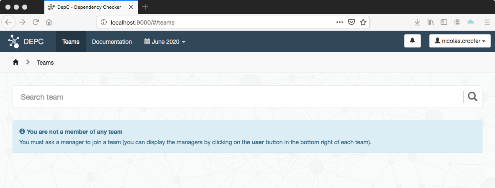
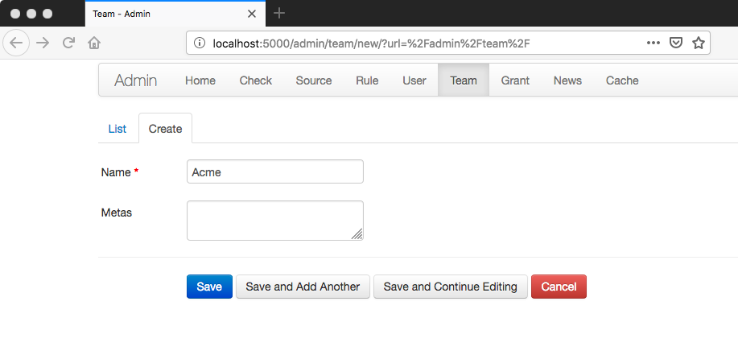
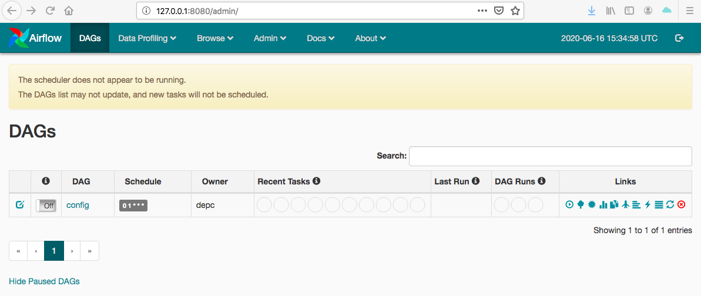
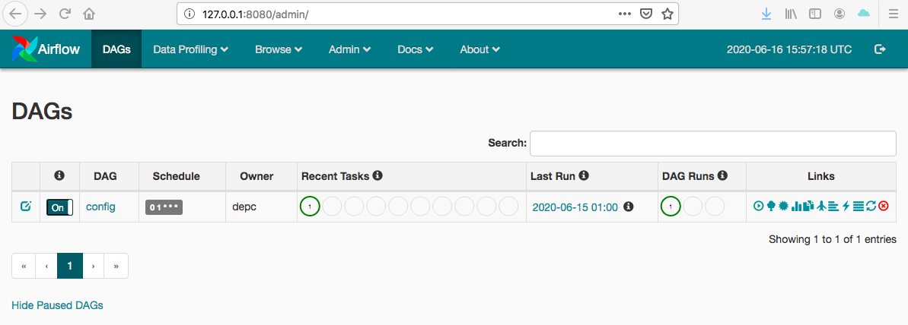

.. _installation:

Installation
============

Preamble
~~~~~~~~

In order to fully run DepC you have to follow several steps described below.
Also, you need to setup your environment with these following software :

- `Redis <https://redis.io/topics/quickstart>`__
- `Kafka (1.1.0) <https://kafka.apache.org/11/documentation.html#quickstart>`__
- The graph database `Neo4j (3.4) <https://neo4j.com/download/>`__
- A RDBMS supported by SQLAlchemy (we suggest `PostgreSQL <https://www.postgresql.org/download/>`__)
- The `Warp10 <https://www.warp10.io/content/02_Getting_started>`__ time series database
- OVH `Beamium <https://github.com/ovh/beamium>`__ to send the computed QoS into Warp10

Take a look on the ``depc.example.yml`` to set the required configuration fields accordingly.

.. note::
    Even if DepC supports also OpenTSDB to compute the QOS, it currently requires the Warp10 database
    to store its own metrics. We are working to make Warp10 optional to run DepC.

.. warning::

    We are aware this installation guide requires multiple manual configuration steps.
    We plan to improve the installation process in a future release.

Create your virtual environment
~~~~~~~~~~~~~~~~~~~~~~~~~~~~~~~

You may need to install Python 3.5+ first, this step can differ depending on your operating system,
please refer to the official `Python documentation <https://docs.python.org/3/using/index.html>`__
for further details.

.. code:: bash

    pip install virtualenv
    virtualenv -p python3 venv
    source venv/bin/activate

Install the requirements
~~~~~~~~~~~~~~~~~~~~~~~~

.. code:: bash

    pip install -r requirements.txt

.. note::
    To support the `Snappy compression library <https://github.com/google/snappy>`__ for the Kafka consumer,
    on Debian-based Linux distribution you have to install the ``libsnappy-dev`` package. Then you can install
    the related Python package.

    .. code:: bash

        pip install python-snappy==0.5.4

Configure your environment
~~~~~~~~~~~~~~~~~~~~~~~~~~
In DepC the root directory, you have to create a new configuration file for your environment
using the provided configuration sample in ``depc.example.yml``.
Name the configuration file ``depc.<env>.yml`` where you should replace ``<env>`` with the
``DEPC_ENV`` value.

Set these environment variables :

.. code:: bash

    export DEPC_HOME="$(pwd)"

    # Then export, one of the following environment variable

    # Development environment will use a depc.dev.yml file
    export DEPC_ENV=dev

    # Testing environment will use a depc.test.yml file
    export DEPC_ENV=test

    # Production environment will use a depc.prod.yml file
    export DEPC_ENV=prod

Then you need to configure the secrets in your configuration. You can generate values with
the following command :

.. code:: bash

    $ python -c "import binascii;from Crypto import Random; print(binascii.hexlify(Random.new().read(32)).decode())"
    62bb303abfd246b2dde9b6513187ede335e238bb957d7c57fdc69d41bf501a0f

Execute it twice to populate the ``SECRET`` and ``DB_ENCRYPTION_KEY`` variables.

Launch the API
~~~~~~~~~~~~~~

Using the Flask development server :

.. code:: bash

    $ export FLASK_ENV=development
    $ export FLASK_APP=manage:app
    $ make api

Using Gunicorn :

.. code:: bash

    $ export FLASK_ENV=production
    $ gunicorn --bind 0.0.0.0:5000 manage:app

Now you can reach the API :

.. code:: bash

    $ curl http://localhost:5000/v1/ping
    {
      "message": "pong"
    }

Setup the Web UI
~~~~~~~~~~~~~~~~

To install and run the Web UI you need to install `Node.js 8 <https://nodejs.org/en/download/releases/>`__.
Then you will be able to run the NPM command-line tool packaged with your Node.js installation.

In the ``ui/`` directory :

.. code:: bash

    $ npm install
    $ npm install bower grunt grunt-cli -g
    $ bower install

.. note::

    In your development environment, you need to fake the authentication gateway, in this case,
    edit the file ``app/scripts/services/httpinterceptor.js`` and lookup for the line below.
    Uncomment this line and replace ``username`` with your own desired user.

    .. code:: javascript

        // config.headers['X-Remote-User'] = 'username';

To start the Web UI :

.. code:: bash

    $ make ui

Now, you can reach the DepC Web UI at : ``http://localhost:9000/#/teams`` :

Create your first team
~~~~~~~~~~~~~~~~~~~~~~

During development you may want to create a new team, grant users, etc... You can
do it using the DepC admin panel at: ``http://localhost:5000/admin``.

You can also force the access with the ``FORCE_INSECURE_ADMIN: true`` value in your
configuration file.

.. warning::

    The ``FORCE_INSECURE_ADMIN`` variable must only be used in development mode,
    we recommend to use a reverse proxy adding the authentication layer in production.

The first thing to do is to create a team in **Admin > Team > Create** :

You can omit the ``meta`` field for now, it will be used to inform users about their own
Grafana access.

Setup Airflow
~~~~~~~~~~~~~

To get more details about how to setup Airflow,
please read the `official documentation <https://airflow.apache.org/index.html>`__.

The first step is to export some variables :

.. code:: bash

    # Add the DepC root directory to the PYTHONPATH
    $ export PYTHONPATH="$(pwd)/:$PYTHONPATH"

    # Specify the DepC scheduler directory as the Airflow root directory
    $ export AIRFLOW_HOME="$(pwd)/scheduler"

Then you can initialize Airflow :

.. code:: bash

    $ airflow initdb

You will have lot's of DAG examples, you can remove them in the airflow configuration
and reset the database :

.. code:: bash

    $ vim scheduler/airflow.cfg
    ...
    load_examples = False
    ...
    $ airflow resetdb

You can now start the webserver :

.. code:: bash

    make webserver

The WebUI is available at http://127.0.0.1:8080 :

As you can see Airflow indicates that the scheduler is not running. Before doing it
we need to change the `captchup` configuration :

.. code:: bash

    $ vim scheduler/airflow.cfg
    ...
    catchup_by_default = False

You can now start the scheduler :

.. code:: bash

    $ make scheduler

As you can see in the web interface the message has disapeared. You can now activate the
`config` DAG :

Start the Kafka consumer
~~~~~~~~~~~~~~~~~~~~~~~~

You have to configure the appropriate fields into your configuration file (section ``CONSUMER``).

Then you can launch the Kafka consumer :

.. code:: bash

    $ make consumer
